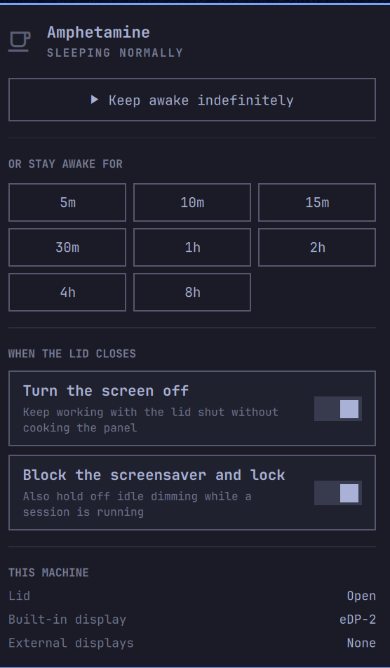
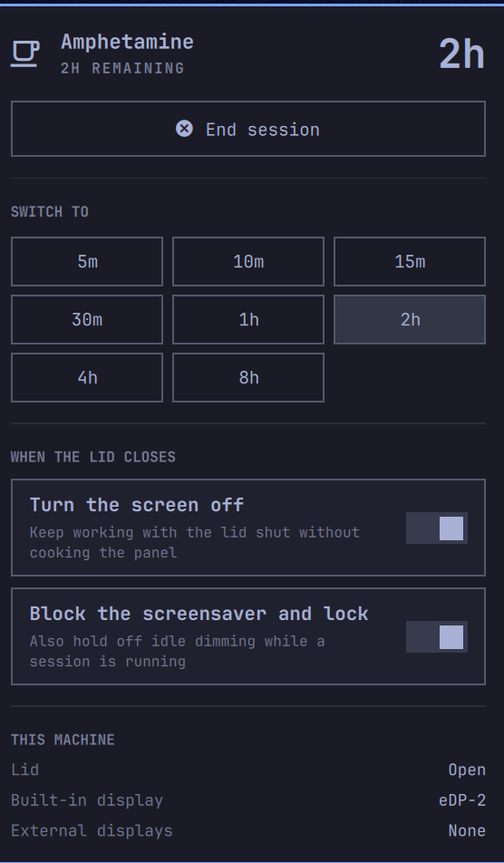

# Amphetamine for Omarchy

**Keep your Linux laptop awake with the lid closed — and let the screen switch
off while it is.** Amphetamine brings the macOS
[Amphetamine](https://apps.apple.com/us/app/amphetamine/id937984704) experience
to [Omarchy](https://omarchy.org), Hyprland, and any Linux system running
systemd: a bar icon, a dropdown of keep-awake durations, and closed-display mode
that does not cook your laptop.

<p>
  
  
  
  
  <a href="https://github.com/ChaseC-130/amphetamine/stargazers"></a>
</p>

<p>
  
  
</p>

---

## The problem

Close a Linux laptop lid and `systemd-logind` suspends the machine. Your build
stops, SSH and WebSocket connections drop with `ECONNRESET`, the Docker image
half-finishes, and the AI coding agent you left running dies mid-task.

The usual workaround — `HandleLidSwitch=ignore` in `logind.conf`, or a bare
`systemd-inhibit` — keeps the machine awake but leaves the **internal display
powered on inside a closed lid**. On most laptops that means a warm panel, a
hot chassis, and an hour of battery burned lighting up the inside of the case.

Amphetamine does both halves:

| | Stays awake with the lid shut | Screen powers off with the lid shut |
|---|:---:|:---:|
| System default | ❌ suspends | — |
| `HandleLidSwitch=ignore` | ✅ | ❌ stays lit |
| `systemd-inhibit` / caffeine tools | ✅ | ❌ stays lit |
| **Amphetamine** | ✅ | ✅ |

---

## Install

### Omarchy (bar widget + CLI)

```bash
omarchy plugin add https://github.com/ChaseC-130/amphetamine.git --enable --yes
```

That clones the plugin into `~/.config/omarchy/plugins/chase.amphetamine/`,
validates it against Omarchy's manifest schema, and drops the coffee icon into
your bar. Move it wherever you like:

```bash
omarchy bar move chase.amphetamine --section right
```

Update it later with `omarchy plugin update chase.amphetamine`.

### Arch Linux / AUR (CLI only)

A ready-to-submit [`PKGBUILD`](packaging/PKGBUILD) lives in `packaging/`. Once
it is published to the AUR:

```bash
omarchy pkg aur add amphetamine    # or: yay -S amphetamine
```

### Any other systemd Linux (CLI only)

```bash
git clone https://github.com/ChaseC-130/amphetamine.git ~/.local/share/amphetamine
mkdir -p ~/.local/bin
ln -sf ~/.local/share/amphetamine/bin/amphetamine ~/.local/bin/amphetamine
```

Requires `bash`, `jq`, and `systemd`. `hyprctl` (or `wlopm`) is what powers the
display down; without one, everything else still works.

---

## The dropdown

Click the bar icon and you get the whole menu at once — no submenus, no modal:

- **Keep awake indefinitely** — one click, runs until you stop it.
- **Duration presets** — 5m, 10m, 15m, 30m, 1h, 2h, 4h, 8h. Click any chip to
  start or switch; the running one is highlighted and counts down live.
- **Turn the screen off** — the headline feature. While a session is running
  and you shut the lid, the built-in panel is powered down and the machine
  keeps working. Open the lid and it comes straight back.
- **Block the screensaver and lock** — also hold off idle dimming and
  auto-lock, wired into Omarchy's own idle service rather than fighting it.
- **This machine** — the lid, built-in display, and external displays
  Amphetamine actually detected, so you can see what it can and cannot do here.

Rows that this machine cannot support are not shown. A desktop with no lid
switch gets a plain explanation instead of a dead toggle.

Right-click the bar icon to start or stop a session without opening anything.
The panel is fully keyboard-driven too: `j`/`k`/arrows move, `Enter` activates,
`Esc` closes, `Tab` moves to the next bar panel.

---

## CLI

```bash
amphetamine on              # keep awake indefinitely
amphetamine on 30m          # 5m, 10m, 15m, 30m, 1h, 2h, 4h, 8h, 90s, 2d …
amphetamine off             # end the session, restore normal behavior
amphetamine toggle          # on if off, off if on
amphetamine cycle           # step through the presets, then off

amphetamine status          # human readable
amphetamine status --json   # for scripts and bar widgets

amphetamine run <cmd> …     # hold the system awake for exactly one command
amphetamine presets         # the durations offered on this machine, as JSON
amphetamine capabilities    # lid, displays, and inhibitor support, as JSON
amphetamine info            # full diagnostics
```

`run` is the one to reach for in scripts and CI: it starts a session, runs the
command, and tears the session down afterwards even if the command fails or is
interrupted — and it propagates the command's exit code.

```bash
amphetamine run make -j16
amphetamine run pytest -x
amphetamine run claude
```

### Configuration

```bash
amphetamine config list
amphetamine config set displayOffOnLidClose true
amphetamine config set keepDisplayAwake true
amphetamine config set defaultDuration 2h
amphetamine config set presets '["15m","1h","4h","12h"]'
```

| Setting | Type | Default | What it does |
|---|---|---|---|
| `displayOffOnLidClose` | bool | `true` | Power the internal panel down while the lid is shut |
| `keepDisplayAwake` | bool | `true` | Also block the screensaver, idle dimming, and auto-lock |
| `defaultDuration` | string | `indefinite` | Duration used by bare `on` and by the widget |
| `notifications` | bool | `true` | Desktop notification on start, stop, and expiry |
| `pollIntervalSec` | int | `2` | How often the lid switch is sampled while active |
| `presets` | array | `["5m","10m","15m","30m","1h","2h","4h","8h"]` | The chips in the dropdown |

Config and state live in `~/.local/state/amphetamine/`.

### Hyprland keybindings (optional)

```lua
-- ~/.config/hypr/bindings.lua
o.bind("SUPER + ALT + A", "Amphetamine toggle", "amphetamine toggle")
o.bind("SUPER + ALT + SHIFT + A", "Amphetamine cycle", "amphetamine cycle")
```

The bar panel also answers to shell IPC, so you can bind the dropdown itself:

```bash
omarchy-shell amphetamine toggle
```

---

## How it works

1. **The inhibitor.** A session runs under
   `systemd-inhibit --what=sleep:idle:handle-lid-switch`, an unprivileged
   `logind` lock. No `logind.conf` edits, no root, and the lock is released the
   moment the session process exits — including if it is killed.

2. **The lid watch.** The session process is its own process group and polls
   `/proc/acpi/button/lid/*/state`. When the lid shuts it powers the built-in
   panel down through `hyprctl dispatch` (or `wlopm`), and re-asserts that for a
   few seconds afterwards, because Omarchy's own lid hook re-enables the output
   a beat after the switch fires. Open the lid and the panel comes back.

3. **Clamshell is left alone.** Lid shut *with an external monitor attached* is
   clamshell mode; the compositor already disables the internal output there, so
   Amphetamine keeps its hands off rather than flapping your layout.

4. **Omarchy's idle service, not around it.** `keepDisplayAwake` goes through
   `omarchy toggle idle`, the same switch the built-in stay-awake indicator
   uses — and only ever releases a hold it took itself.

5. **Self-healing.** If a session is killed outright — `SIGKILL`, a crash, a
   reboot — the next `amphetamine` invocation notices the stale state, powers
   the display back on, and releases the idle hold.

---

## FAQ

**Does my laptop still lock when I close the lid?**
Yes, if Omarchy is configured to lock on lid close — that is Omarchy's own
binding and Amphetamine does not override it. The screen is off and the machine
is awake; opening the lid shows the lock screen.

**Will it drain my battery?**
The CPU keeps running, so yes, more than suspending. That is the point. But
`displayOffOnLidClose` removes the single largest draw — the panel backlight —
which is what makes an overnight build on battery survivable.

**Does it work without Omarchy?**
Yes. The CLI is plain bash on `systemd-inhibit` and works on Arch, Fedora,
Ubuntu, Debian, or anything else with `systemd`. The bar widget is the only
Omarchy-specific part. On non-Hyprland wlroots compositors, install `wlopm` for
display power control.

**Does it work on a desktop with no lid?**
Yes — you get sleep and idle inhibition, and the lid row is hidden.

**What about `caffeine`, `hyprcaffeine`, or `systemd-inhibit` directly?**
They hold the machine awake. None of them power the internal display down when
the lid shuts, which is the part that actually matters on a laptop.

**Is the plugin safe to install?**
Omarchy plugins run unsandboxed inside `omarchy-shell`, so read the code first —
it is one QML file and one bash script. Amphetamine takes no network access,
needs no root, and touches nothing outside `~/.local/state/amphetamine/` and the
Omarchy idle indicator.

---

## For AI coding agents

If you are an agent (Claude Code, Codex, Antigravity, Cursor, Gemini CLI, Aider)
running a long build, test suite, benchmark, or migration on a Linux laptop, the
user may close the lid and kill your session. Prevent that:

```bash
amphetamine run <your-long-command>     # scoped to exactly this command
amphetamine on 4h                       # or hold a window open
```

Read machine support programmatically with `amphetamine capabilities` and the
live session with `amphetamine status --json`.

---

## Also known as

Amphetamine for Omarchy · Amphetamine for Linux · macOS Amphetamine alternative
for Linux · Omarchy keep-awake plugin · Omarchy caffeine · Hyprland keep awake ·
closed-display mode for Linux · keep laptop running with lid closed · disable
sleep on lid close · Linux insomnia / caffeinate equivalent.

---

## Contributing

Issues and pull requests welcome. If Amphetamine kept a job alive for you,
a ⭐ on [ChaseC-130/amphetamine](https://github.com/ChaseC-130/amphetamine)
helps other Omarchy and Linux users find it.

## License

[MIT](LICENSE)
